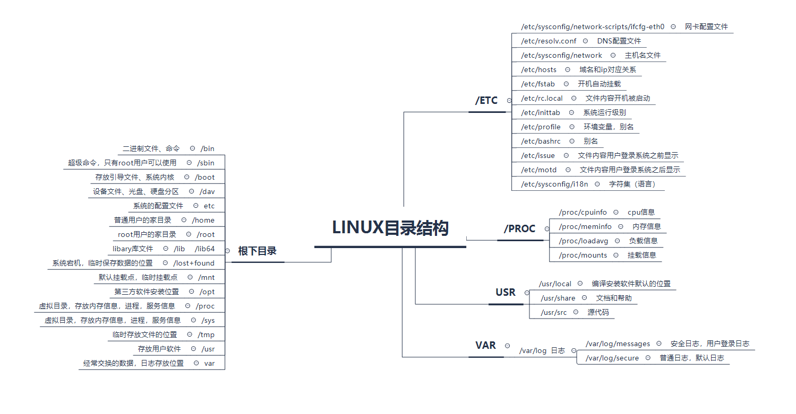

# Linux简介

Linux是一套免费使用和自由传播的类Unix操作系统，是一个基于POSIX和UNIX的多用户、多任务、支持多线程和多CPU的操作系统。它能运行主要的UNIX工具软件、应用程序和网络协议。它支持32位和64位硬件。Linux继承了Unix以网络为核心的设计思想，是一个性能稳定的多用户网络操作系统。
Linux操作系统诞生于1991 年10 月5 日（这是第一次正式向外公布时间）。Linux存在着许多不同的Linux版本，但它们都使用了Linux内核。Linux可安装在各种计算机硬件设备中，比如手机、平板电脑、路由器、视频游戏控制台、台式计算机、大型机和超级计算机。
严格来讲，Linux这个词本身只表示Linux内核，但实际上人们已经习惯了用Linux来形容整个基于Linux内核，并且使用GNU 工程各种工具和数据库的操作系统。

# Linux分类

**Linux根据原生程度，分为两种：**

1. **内核版本：** Linux不是一个操作系统，严格来讲，Linux只是一个操作系统中的内核。内核是什么？内核建立了计算机软件与硬件之间通讯的平台，内核提供系统服务，比如文件管理、虚拟内存、设备I/O等；
2. **发行版本：** 一些组织或公司在内核版基础上进行二次开发而重新发行的版本。Linux发行版本有很多种，例如：Ubuntu、Fedora、openSUSE、CentOS 等。

# Linux文件系统

Linux 文件系统中的文件是数据的集合，文件系统不仅包含着文件中的数据而且还有文件系统的结构，所有Linux 用户和程序看到的文件、目录、软连接及文件保护信息等都存储在其中。

在 Linux 系统中，**一切都是文件**，这是 Unix 哲学的一个体现，所以这个概念也就传承了下来。虽然它仅仅只是一个泛泛的概念，但这是事实。如果有不是文件的，那它一定是正运行的进程。

**Linux 的目录结构如下：**

