# 多路搜索树
B-tree是一种常见的数据结构。使用B-tree结构可以显著减少定位记录时所经历的中间过程，从而加快存取速度。这种数据结构一般用于数据库的索引，综合效率较高。

- B-tree
    - 定义任意非叶子结点最多只有 M 个儿 子；且 M>2
    - 根结点的儿子数为 [2, M] 
    - 除根结点以外的非叶子结点的儿子数为 [ceil(M/2), M] 
    - 每个结点存放至少 ceil(M/2-1) 和至多 M-1 个关键字
    - 非叶子结点的关键字个数 = 指向儿子的指针个数减1 
    - 非叶子结点的关键字： K[1], K[2], …, K[M-1] ；且 K[i] < K[i+1] 
    - 非叶子结点的指针： P[1], P[2], …, P[M] ；其中 P[1] 指向关键字小于 K[1] 的子树， P[M] 指向关键字大于 K[M-1] 的子树，其它 P[i] 指 向关键字属于 (K[i-1], K[i]) 的子树
    - 所有叶子结点位于同一层
    
    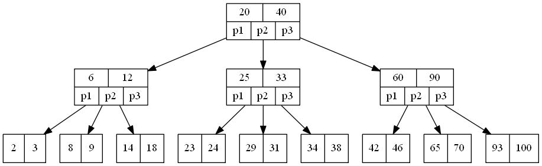

- B-tree的搜索
	- 从根结点开始，对结点内的关键字（有序）序列进行二分查找，如果命中则结束，否则进入查询关键字所属范围的儿子结点；重复，直到所对应的儿子指针为空，或已经是叶子结点
	
- B-tree的特性
	- 关键字集合分布在整颗树中
	- 任何一个关键字出现且只出现在一个结点中
	- 搜索有可能在非叶子结点结束
	- 其搜索性能等价于在关键字全集内做一次二分查找
	- 自动层次控制
	
- 模拟查找文件29的过程
	- 根据根结点指针找到文件目录的根磁盘块1，将其中的信息导入内存。【磁盘IO操作1次】
	- 此时内存中有两个文件名17，35和三个存储其他磁盘页面地址的数据。根据算法我们发现17<29<35，因此我们找到指针p2。
	- 根据p2指针，我们定位到磁盘块3，并将其中的信息导入内存。【磁盘IO操作2次】
	- 此时内存中有两个文件名26，30和三个存储其他磁盘页面地址的数据。根据算法我们发现26<29<30，因此我们找到指针p2。
	- 根据p2指针，我们定位到磁盘块8，并将其中的信息导入内存。【磁盘IO操作3次】
	- 此时内存中有两个文件名28，29。根据算法我们查找到文件29，并定位了该文件内存的磁盘地址。
	
- 插入与删除
	- 插入（insert）操作：插入一个元素时，首先在B-tree中是否存在，如果不存在，即在叶子结点处结束，然后在叶子结点中插入该新的元素，注意：如果叶子结点空间足够，这里需要向右移动该叶子结点中大于新插入关键字的元素，如果空间满了以致没有足够的空间去添加新的元素，则将该结点进行“分裂”，将一半数量的关键字元素分裂到新的其相邻右结点中，中间关键字元素上移到父结点中（当然，如果父结点空间满了，也同样需要“分裂”操作），而且当结点中关键元素向右移动了，相关的指针也需要向右移。如果在根结点插入新元素，空间满了，则进行分裂操作，这样原来的根结点中的中间关键字元素向上移动到新的根结点中，因此导致树的高度增加一层。
		- 插入以下字符字母到空的5阶B-tree中：C N G A H E K Q M F W L T Z D P R X Y S，5阶意味着一个结点最多有5个孩子和4个关键字，除根结点外其他结点至少有2个关键字，首先，结点空间足够，4个字母插入相同的结点中，如下图：
		
		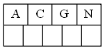
		
		- 当咱们试着插入H时，结点发现空间不够，以致将其分裂成2个结点，移动中间元素G上移到新的根结点中，在实现过程中，咱们把A和C留在当前结点中，而H和N放置新的其右邻居结点中。如下图：
		
        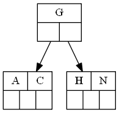

		- 当咱们插入E,K,Q时，不需要任何分裂操作
		
        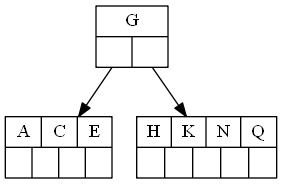
		
		- 插入M需要一次分裂，然后M是中间关键字元素，移到父节点中
		
        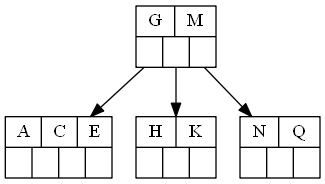
		
		- 插入F,W,L,T不需要任何分裂操作
		
        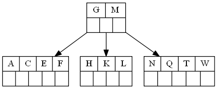
		
		- 插入Z时，最右的叶子结点空间满了，需要进行分裂操作，中间元素T上移到父节点中，注意通过上移中间元素，树最终还是保持平衡，分裂结果的结点存在2个关键字元素。
		
        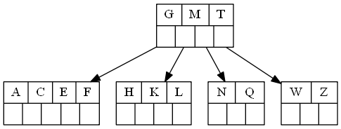
		
		- 插入D时，导致最左边的叶子结点被分裂，D是中间元素，上移到父节点中，然后字母P,R,X,Y陆续插入不需要任何分裂操作。
		
        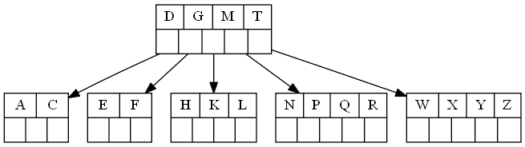
		
		- 最后，当插入S时，含有N,P,Q,R的结点需要分裂，中间元素Q上移到父节点中，但是父节点中空间已经满了，所以也要进行分裂，将父节点中的中间元素M上移到新形成的根结点中，注意以前在父节点中的第三个指针在修改后包括D和G节点中。

        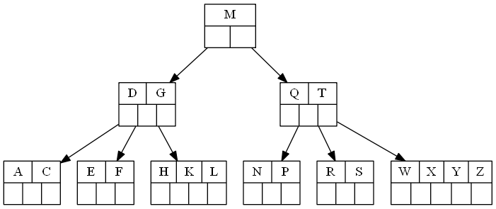
		
	- 删除(delete)操作：首先查找B-tree中需删除的元素,如果该元素在B-tree中存在，则将该元素在其结点中进行删除，如果删除该元素后，首先判断该元素是否有左右孩子结点，如果有，则上移孩子结点中的某相近元素到父节点中，然后是移动之后的情况；如果没有，直接删除后，移动之后的情况。
		- 以上述插入操作构造的一棵5阶B-tree为例，依次删除H,T,R,E。首先删除元素H，当然首先查找H，H在一个叶子结点中，且该叶子结点元素数目3大于最小元素数目ceil(m/2)-1=2，则操作很简单，咱们只需要移动K至原来H的位置，移动L至K的位置（也就是结点中删除元素后面的元素向前移动）
		
        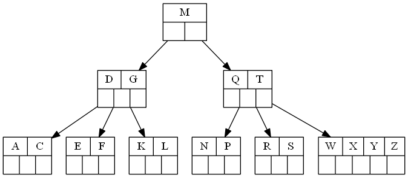
		
		- 下一步，删除T,因为T没有在叶子结点中，而是在中间结点中找到，咱们发现他的继承者W(字母升序的下个元素)，将W上移到T的位置，然后将原包含W的孩子结点中的W进行删除，这里恰好删除W后，该孩子结点中元素个数大于2，无需进行合并操作。
		
        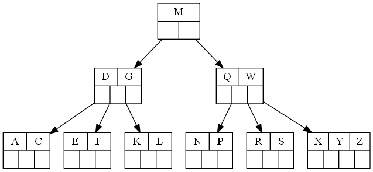
		
		- 下一步删除R，R在叶子结点中,但是该结点中元素数目为2，删除导致只有1个元素，已经小于最小元素数目ceil(5/2)-1=2,如果其某个相邻兄弟结点中比较丰满（元素个数大于ceil(5/2)-1=2），则可以向父结点借一个元素，然后将最丰满的相邻兄弟结点中上移最后或最前一个元素到父节点中，在这个实例中，右相邻兄弟结点中比较丰满（3个元素大于2），所以先向父节点借一个元素W下移到该叶子结点中，代替原来S的位置，S前移；然后X在相邻右兄弟结点中上移到父结点中，最后在相邻右兄弟结点中删除X，后面元素前移。
		
        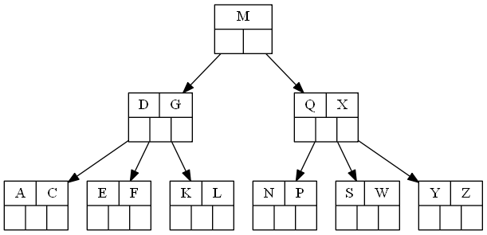
		
		- 最后一步删除E，删除后会导致很多问题，因为E所在的结点数目刚好达标，刚好满足最小元素个数（ceil(5/2)-1=2）,而相邻的兄弟结点也是同样的情况，删除一个元素都不能满足条件，所以需要该节点与某相邻兄弟结点进行合并操作；首先移动父结点中的元素（该元素在两个需要合并的两个结点元素之间）下移到其子结点中，然后将这两个结点进行合并成一个结点。所以在该实例中，咱们首先将父节点中的元素D下移到已经删除E而只有F的结点中，然后将含有D和F的结点和含有A,C的相邻兄弟结点进行合并成一个结点。
		
        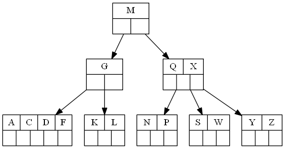

		- 也许你认为这样删除操作已经结束了，其实不然，在看看上图，对于这种特殊情况，你立即会发现父节点只包含一个元素G，没达标，这是不能够接受的。如果这个问题结点的相邻兄弟比较丰满，则可以向父结点借一个元素。假设这时右兄弟结点（含有Q,X）有一个以上的元素（Q右边还有元素），然后咱们将M下移到元素很少的子结点中，将Q上移到M的位置，这时，Q的左子树将变成M的右子树，也就是含有N，P结点被依附在M的右指针上。所以在这个实例中，咱们没有办法去借一个元素，只能与兄弟结点进行合并成一个结点，而根结点中的唯一元素M下移到子结点，这样，树的高度减少一层。
		
        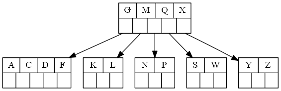

# B+tree
结点结构与B-tree相同，不同的是各结点的关键字和可以拥有的子结点数。如m阶B+树中，每个结点至多可以拥有m个子结点。非根结点至少有[m/2]个子结点，而关键字个数比B-tree多一个，为[m/2]~m

- 不同之处
  - B树中同一键值不会出现多次，并且它有可能出现在叶结点，也有可能出现在非叶结点中。而B+树的键一定会出现在叶结点中，并且有可能在非叶结点中也有可能重复出现，以维持B+树的平衡。
  - 因为B树键位置不定，且在整个树结构中只出现一次，虽然可以节省存储空间，但使得在插入、删除操作复杂度明显增加。B+树相比来说是一种较好的折中。
  - B树的查询效率与键在树中的位置有关，最大时间复杂度与B+树相同(在叶结点的时候)，最小时间复杂度为1(在根结点的时候)。而B+树的时间复杂度对某建成的树是固定的。

- B+tree的特性
	 - 所有关键字都出现在叶子结点的链表中（稠密索引），且链表中的关键字恰好是有序的
	 - 不可能在非叶子结点命中
	 - 非叶子结点相当于是叶子结点的索引（稀疏索引），叶子结点相当于是存储（关键字）数据的数据层
	 - 更适合文件索引系统
	 
     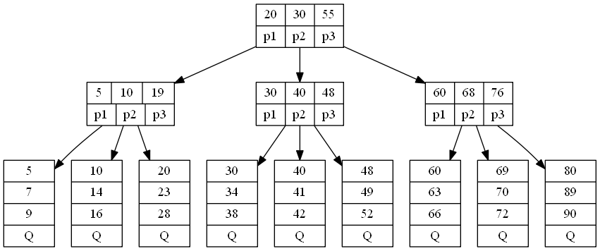

# 小结
- B 树：二叉树，每个结点只存储一个关键字，等于则命中，小于走左结点，大于走右结点
- B- 树：多路搜索树，每个结点存储 M/2 到 M 个关键字，非叶子结点存储指向关键字范围的子结点
- 所有关键字在整颗树中出现，且只出现一次，非叶子结点可以命中
- B+ 树：在 B- 树基础上，为叶子结点增加链 表指针，所有关键字都在叶子结点中出现，非叶子结点作为叶子结点的索引； B+ 树总 是到叶子结点才命中
- B* 树：在 B+ 树基础上，为非叶子结点也增 加链表指针，将结点的最低利用率从 1/2 提高到 2/3