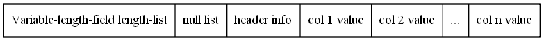
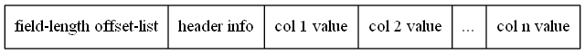

# 行格式

>我们将`Mysql`在磁盘内最基本的存储单位称之为页，`InnoDB`的页大小一般为`16KB`

`Mysql`一条记录的最大储存空间是有限的除了各种`blob`与`text`外，其他所有列的占用储存空间之和（包括隐藏列与记录头）不能大于`65535`。
一般`Mysql`要求一页至少存储两条记录，所以当记录中内容过多时，`Mysql`会将部分的数据储存到其他的页中，使用链表进行关联，这种现象叫做`行溢出`。

 - Compact
 
    

 - Redundant
 
    
 
 - Dynamic
    + 把所有的字节都存储到其他页中
 - Compressed
    + 把所有的字节都存储到其他页中
    + 采用压缩算法对页面进行压缩
 

